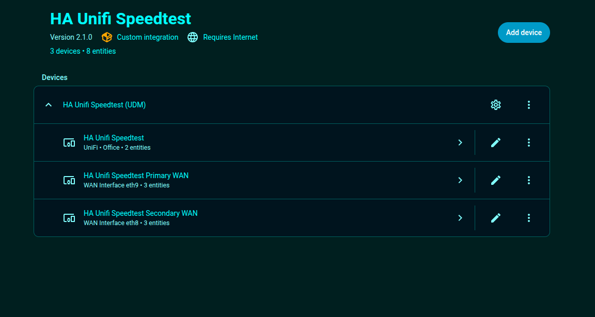
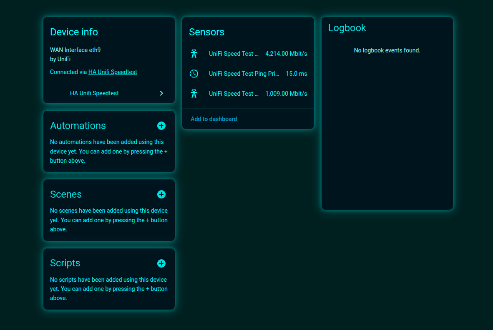
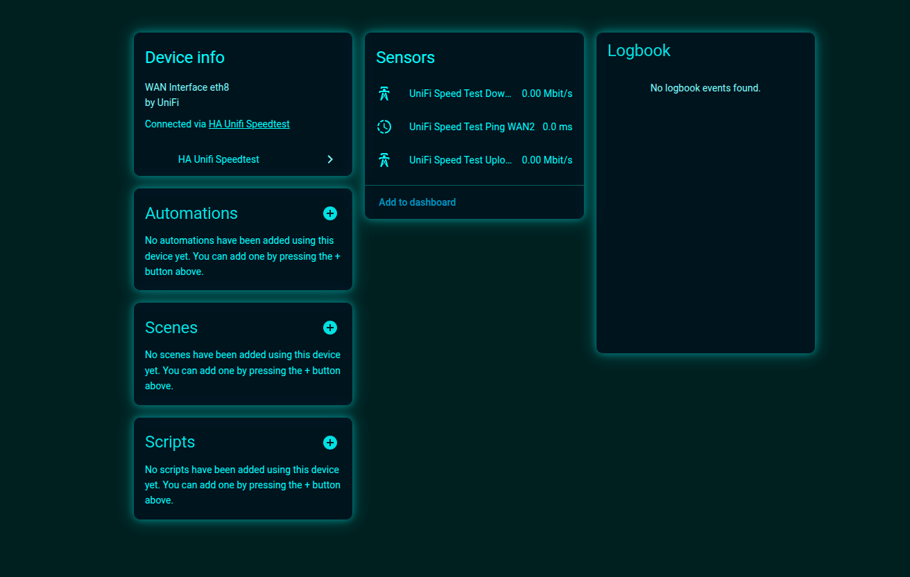

[](https://github.com/sponsors/biofects?frequency=recurring&sponsor=biofects)


# 🌐 UniFi Speedtest for Home Assistant

## 🔍 About

This Home Assistant custom integration provides real-time speed test monitoring for UniFi networks with **enhanced dual WAN support**. It supports all UniFi platforms including UDM Pro, UDM SE, Cloud Key, and traditional UniFi Controller software, allowing you to track download speed, upload speed, and ping directly within Home Assistant.

**🆕 NEW: Multi-WAN Detection** - Automatically detects and creates separate sensors for each WAN interface in dual WAN setups, solving the issue where both WANs showed identical speeds.

[](https://github.com/custom-components/hacs)
[![GitHub Release][releases-shield]][releases]
![Project Maintenance][maintenance-shield]

---
## 💸 Donations Appreciated!
If you find this plugin useful, please consider donating. Your support is greatly appreciated!

### Sponsor me on GitHub
[](https://github.com/sponsors/biofects?frequency=recurring&sponsor=biofects) 

### or
## Paypal

[](https://www.paypal.com/cgi-bin/webscr?cmd=_s-xclick&hosted_button_id=TWRQVYJWC77E6)
---


---

## ✨ Features

- **🌐 Dual WAN Support**: Automatically detects and monitors multiple WAN interfaces separately
- **🔧 Universal Compatibility**: Works with UDM Pro, UDM SE, UDM Base, Cloud Key Gen2+, and traditional UniFi Controllers
- **📊 Real-time Metrics**: Monitor download speeds, upload speeds, and network latency (ping) for each WAN
- **🚀 Speed Test Initiation**: Start speed tests remotely via Home Assistant (traditional controllers)
- **🏠 Home Assistant Integration**: Full integration with automations, scripts, and dashboards
- **⚙️ Configurable**: Enable/disable multi-WAN detection, adjust polling intervals, and customize scheduling

## 📸 Screenshots

### Configuration
Configure multi-WAN support during setup to enable separate monitoring for each WAN interface:



### Dual WAN Monitoring in Action
See how the integration creates separate sensors for each WAN interface, providing individual speed metrics:

#### WAN 1 Sensors
Monitor your primary WAN connection with dedicated sensors for download, upload, and ping:



#### WAN 2 Sensors  
Track your secondary WAN connection independently with its own set of performance metrics:



*Notice how each WAN interface gets its own sensors, solving the issue where dual WAN setups previously showed identical speeds for both connections.*

## 🏗 Supported Systems

### ✅ UDM Pro / UDM SE
- **Multi-WAN Support**: ✅ Full dual WAN detection and monitoring
- **Speed Test Monitoring**: ✅ Automatic retrieval of speed test results
- **Separate Sensors**: ✅ Individual sensors for each WAN interface
- **URL Format**: `https://udm-ip` (port 443)

### ✅ UDM Base
- **Multi-WAN Support**: ❌ Single WAN hardware limitation
- **Speed Test Monitoring**: ✅ Standard monitoring for single WAN
- **Backward Compatible**: ✅ Works exactly as before
- **URL Format**: `https://udm-ip` (port 443)

### ✅ Cloud Key Gen2+ with Multi-WAN Gateway
- **Multi-WAN Support**: ✅ Depends on gateway model (USG Pro 4, UXG Pro)
- **Speed Test Monitoring**: ✅ Full functionality
- **API Support**: ✅ Modern UniFi OS endpoints
- **URL Format**: `https://cloudkey-ip` (port 443)

### ✅ Traditional UniFi Controller Software
- **Multi-WAN Support**: ⚠️ Depends on gateway hardware
- **Speed Test Monitoring**: ✅ Full functionality including API-initiated tests
- **Legacy Support**: ✅ Enhanced compatibility with older API structures
- **URL Format**: `https://controller-ip:8443`

## 🚀 Installation

### HACS Installation (Recommended)

1. Open HACS in your Home Assistant instance
2. Click on "Integrations"
3. Click the three dots in the top right corner
4. Select "Custom repositories"
5. Add this repository URL
6. Select "Integration" as the category
7. Click "Add"
8. Find "HA Unifi Speedtest" in the integration list
9. Click "Download"
10. Restart Home Assistant

### Manual Installation

1. Download the latest release
2. Copy the `custom_components/ha_unifi_speedtest` directory to your Home Assistant's `custom_components` directory
3. Restart Home Assistant

## ⚙ Configuration

1. Go to Configuration > Integrations
2. Click "+" to add a new integration
3. Search for "HA Unifi Speedtest"
4. Enter the following details:
   - **URL**: Your UniFi Controller URL
     - UDM Pro/SE: `https://udm-ip`
     - Cloud Key Gen2+: `https://cloudkey-ip`
     - Traditional Controller: `https://controller-ip:8443`
   - **Username**: UniFi Controller admin username
   - **Password**: UniFi Controller admin password
   - **Controller Type**: Select your controller type
     - `udm` - for UDM Pro, UDM SE, UDM Base, Cloud Key Gen2+
     - `controller` - for traditional UniFi Controller software
   - **Site** (Optional): Site name (default: "default")
   - **SSL Verification** (Optional): Enable/disable SSL certificate verification
   - **🆕 Enable Multi-WAN Detection**: Toggle multi-WAN sensor creation (default: enabled)
   - **Enable Automatic Speed Tests**: Schedule regular speed tests
   - **Speed Test Interval**: How often to run automatic tests (15-1440 minutes)

📋 **See the [Screenshots](#-screenshots) section above for visual examples of the configuration process and resulting sensors.**

## 📡 Sensors

### Single WAN Setup
The integration creates three sensors for monitoring network performance:

- **UniFi Speed Test Download Speed** (Mbit/s)
- **UniFi Speed Test Upload Speed** (Mbit/s)  
- **UniFi Speed Test Ping** (ms)

### 🆕 Dual WAN Setup
For multi-WAN configurations, separate sensors are created for each WAN interface:

**WAN 1:**
- **UniFi Speed Test Download Speed WAN** (Mbit/s)
- **UniFi Speed Test Upload Speed WAN** (Mbit/s)  
- **UniFi Speed Test Ping WAN** (ms)

**WAN 2:**
- **UniFi Speed Test Download Speed WAN2** (Mbit/s)
- **UniFi Speed Test Upload Speed WAN2** (Mbit/s)  
- **UniFi Speed Test Ping WAN2** (ms)

### Additional Sensors
- **UniFi Speed Test Runs**: Track total number of speed tests performed
- **UniFi API Health**: Monitor integration connection status

### 🏷️ Sensor Attributes

Each multi-WAN sensor includes additional attributes:
- `interface_name`: Physical interface (e.g., "eth9", "eth10")
- `wan_networkgroup`: WAN group name (e.g., "WAN", "WAN2")
- `wan_number`: Sequential WAN number
- `total_wan_interfaces`: Total detected WAN interfaces
- `is_primary_wan`: Boolean indicating primary WAN
- `timestamp`: Last speedtest timestamp
- `status`: Interface status

## 🔧 Services

### `ha_unifi_speedtest.start_speed_test`

Initiates a speed test on your UniFi network.

**Note**: Only available for traditional UniFi Controller software. UDM Pro users must start speed tests manually via the UniFi Network web interface.

#### Example Usage:

**In Automations:**
```yaml
action:
  - service: ha_unifi_speedtest.start_speed_test
```

**In Scripts:**
```yaml
test_network_speed:
  sequence:
    - service: ha_unifi_speedtest.start_speed_test
    - delay: "00:02:00"  # Wait for test to complete
    - service: notify.mobile_app
      data:
        message: "Speed test completed. Download: {{ states('sensor.unifi_speed_test_download_speed') }} Mbps"
```

**Lovelace Button:**
```yaml
type: button
name: Start Speed Test
tap_action:
  action: call-service
  service: ha_unifi_speedtest.start_speed_test
```

### `ha_unifi_speedtest.get_speed_test_status`

Manually refreshes speed test data from your UniFi controller.

## 📊 Example Dashboard

```yaml
type: entities
title: Network Speed Test
entities:
  - entity: sensor.unifi_speed_test_download_speed
    name: Download Speed
  - entity: sensor.unifi_speed_test_upload_speed  
    name: Upload Speed
  - entity: sensor.unifi_speed_test_ping
    name: Ping
```

# HA UniFi Speedtest v2.0.1 - Update Notes

## 🆕 What's New in v2.0.1
### ✅ **Multi-WAN Support** (Fixed and Enhanced)
- **Dual WAN Detection**: Automatically detects and creates separate sensors for each WAN interface
- **Individual WAN Monitoring**: Each WAN interface gets its own dedicated sensors for download, upload, and ping
- **Universal Compatibility**: Works with all UniFi controller types (UDM Pro, UDM SE, UDM Base, Cloud Key Gen2+, and traditional software)
- **Automatic Fallback**: Gracefully falls back to single WAN mode when only one interface is detected
- **Optional Configuration**: Multi-WAN support can be enabled/disabled during setup

### ✅ **Enhanced Controller Compatibility**
- **UDM Pro/SE Enhanced**: Improved API handling for UniFi OS-based controllers
- **Traditional Controller Optimized**: Better support for legacy UniFi Controller software
- **Cloud Key Gen2+ Support**: Full compatibility with Cloud Key Generation 2 Plus controllers
- **Unified API Interface**: Single codebase handles all controller variations seamlessly

### ✅ **Previous Updates (v1.4.0)**
- **Added Poll Control**: Configurable poll interval
- **Fixed Compatibility Issues**: Resolved UDM and Software-based controller issues
- **Adjusted Initial Run Time**: Corrected initial run timing for software controllers
- **Manual Speed Test Button**: Added on-demand speed test capability

### ✅ **Manual Speed Test Button**
Add this button to your dashboard for on-demand speed tests:

```yaml
show_name: true
show_icon: true
type: button
name: Start Speed Test
icon: mdi:speedometer
tap_action:
  action: call-service
  service: ha_unifi_speedtest.start_speed_test
```

## 📊 Available Sensors

- **UniFi Speed Test Download Speed** - Download speed in `Mbit/s`
- **UniFi Speed Test Upload Speed** - Upload speed in `Mbit/s`  
- **UniFi Speed Test Ping** - Latency in `ms`

## 🔧 Compatibility

- ✅ **UDM Pro / UDM SE / Cloud Key** - Full support with automatic speed test triggering
- ✅ **Traditional UniFi Controller Software** - Full support
- ✅ **Both controller types** get fresh speed test data every hour automatically

## 🚀 Quick Setup

1. **Install Integration**: Add via HACS or copy files to `custom_components/ha_unifi_speedtest/`
2. **Configure**: Settings → Devices & Services → Add Integration → "HA Unifi Speedtest"
3. **Enter Details**: Your UniFi controller URL, username, password, and controller type
4. **Done!**: Sensors will appear automatically with hourly speed tests

---

*The integration now works seamlessly with both UDM Pro and traditional UniFi Controllers, providing regular speed test data with proper Home Assistant unit standards.*

## 🔧 Troubleshooting

### Common Issues

**403 Forbidden Error**: 
- Verify your username/password are correct
- Ensure the user account has admin privileges
- For UDM Pro: Disable 2FA temporarily or create a local admin user

**Connection Refused**:
- Check the URL format matches your controller type
- Verify the controller is accessible from Home Assistant
- Check firewall settings

**No Speed Test Data**:
- Ensure at least one speed test has been run on your controller
- Traditional controllers: Use the `start_speed_test` service
- UDM Pro: Run a speed test via the web interface first

### Debug Logging

To enable debug logging, add the following to your `configuration.yaml`:

```yaml
logger:
  default: info
  logs:
    custom_components.ha_unifi_speedtest: debug
```

## 🤝 Contributing

Feel free to contribute to this project. Please read the contributing guidelines before making a pull request.

## 📜 License

This project is licensed under the MIT License - see the LICENSE file for details.

## ⚖ Disclaimer

This integration is not affiliated with Ubiquiti Inc. or UI.com. All product names, logos, and brands are property of their respective owners.

[releases-shield]: https://img.shields.io/github/release/tfam/ha_unifi_speedtest.svg
[releases]: https://github.com/tfam/ha_unifi_speedtest/releases
[maintenance-shield]: https://img.shields.io/maintenance/yes/2024.svg

