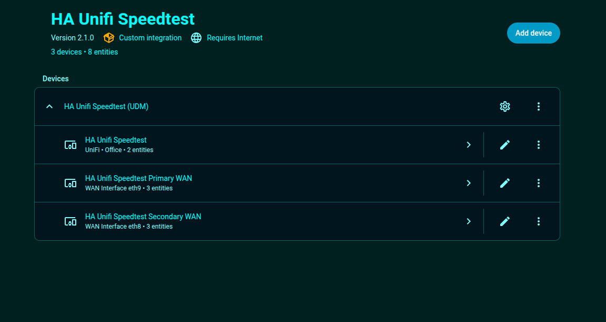
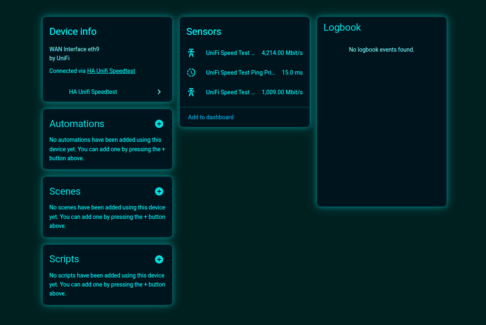
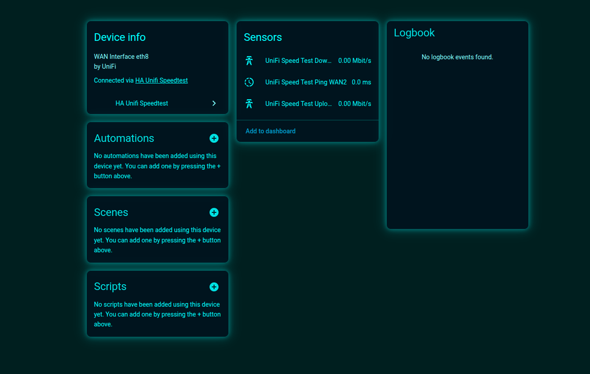

[](https://github.com/sponsors/biofects?frequency=recurring&sponsor=biofects)


# 🌐 UniFi Speedtest for Home Assistant
# I will be pushing updates soon, sorry all i have been away for a while

## 🔍 About

This Home Assistant custom integration provides real-time speed test monitoring for UniFi networks with **full Multi-WAN support**. It supports all UniFi platforms including UDM Pro, UDM SE, Cloud Key, and self-hosted UniFi Controller software, allowing you to track download speed, upload speed, and ping directly within Home Assistant.

**🆕 v3.0.0: API Key Authentication & Modular Architecture** - Simplified authentication with API keys for UDM/UniFi OS, username/password for self-hosted controllers, and separated code architecture for better maintainability.

[](https://github.com/custom-components/hacs)
[](https://github.com/biofects/HA-Unifi-Speedtest/releases)
[](https://github.com/biofects/HA-Unifi-Speedtest/commits/main)
[](https://github.com/biofects/HA-Unifi-Speedtest/issues)
[](https://github.com/biofects/HA-Unifi-Speedtest/blob/main/LICENSE)

---
## 💸 Donations Appreciated!
If you find this plugin useful, please consider donating. Your support is greatly appreciated!

### Sponsor me on GitHub
[](https://github.com/sponsors/biofects?frequency=recurring&sponsor=biofects) 

### or
## Paypal

[](https://www.paypal.com/cgi-bin/webscr?cmd=_s-xclick&hosted_button_id=TWRQVYJWC77E6)
---


---

## ✨ Features

- **🔐 Simplified Authentication**: API key for UDM/UniFi OS, username/password for self-hosted controllers
- **🎯 Two-Step Configuration**: First select controller type, then provide appropriate credentials
- **🌐 Full Multi-WAN Support**: Separate devices and sensors for each WAN interface (WAN, WAN2, WAN3, etc.)
- **📊 Dynamic Entity Creation**: Entities appear automatically once speed test data exists for each WAN
- **🔧 Universal Compatibility**: Works with UDM Pro, UDM SE, UDM Base, Cloud Key Gen2+, and self-hosted UniFi Controllers
- **⚡ Real-time Metrics**: Monitor download speeds, upload speeds, and network latency (ping) for each WAN
- **🚀 Manual Speed Tests**: Button entities for triggering tests on all WANs or specific interfaces
- **⏱️ Faster Updates**: Automatic refresh scheduling after tests complete for immediate result visibility
- **🏠 Home Assistant Integration**: Full integration with automations, scripts, and dashboards
- **🏷️ Clean Naming**: Compact sensor names with Primary/Secondary WAN designation
- **👁️ Optional Inactive WAN Display**: Choose whether to show disconnected/inactive WAN interfaces
- **🔒 Reliable API Usage**: Uses official UniFi API endpoints with proper fallback handling

## 📸 Screenshots

### Configuration
Configure multi-WAN support during setup to enable separate monitoring for each WAN interface:



### Dual WAN Monitoring in Action
See how the integration creates separate sensors for each WAN interface, providing individual speed metrics:

#### WAN 1 Sensors
Monitor your primary WAN connection with dedicated sensors for download, upload, and ping:



#### WAN 2 Sensors  
Track your secondary WAN connection independently with its own set of performance metrics:



*Notice how each WAN interface gets its own sensors, solving the issue where dual WAN setups previously showed identical speeds for both connections.*

## 🏗 Supported Systems

### ✅ UDM Pro / UDM SE
- **Multi-WAN Support**: ✅ Full dual WAN detection and monitoring
- **Speed Test Monitoring**: ✅ Automatic retrieval of speed test results
- **Separate Sensors**: ✅ Individual sensors for each WAN interface
- **URL Format**: `https://udm-ip` (port 443)

### ✅ UDM Base
- **Multi-WAN Support**: ❌ Single WAN hardware limitation
- **Speed Test Monitoring**: ✅ Standard monitoring for single WAN
- **Backward Compatible**: ✅ Works exactly as before
- **URL Format**: `https://udm-ip` (port 443)

### ✅ Cloud Gateway / Cloud Gateway Ultra
- **Multi-WAN Support**: ✅ Full dual WAN detection and monitoring
- **Speed Test Monitoring**: ✅ Full functionality
- **API Support**: ✅ Modern UniFi OS endpoints
- **URL Format**: `https://cloudgateway-ip` (port 443)
- **⚠️ Important**: API key MUST be created via local access (see configuration below)
- **Thanks to**: [@pterhaar](https://github.com/pterhaar) for Cloud Gateway testing and documentation

### ✅ Cloud Key Gen2+ with Multi-WAN Gateway
- **Multi-WAN Support**: ✅ Depends on gateway model (USG Pro 4, UXG Pro)
- **Speed Test Monitoring**: ✅ Full functionality
- **API Support**: ✅ Modern UniFi OS endpoints
- **URL Format**: `https://cloudkey-ip` (port 443)

### ✅ Traditional UniFi Controller Software
- **Multi-WAN Support**: ⚠️ Depends on gateway hardware
- **Speed Test Monitoring**: ✅ Full functionality including API-initiated tests
- **Legacy Support**: ✅ Enhanced compatibility with older API structures
- **URL Format**: `https://controller-ip:8443`

## 🚀 Installation

### HACS Installation (Recommended)

1. Open HACS in your Home Assistant instance
2. Click on "Integrations"
3. Click the three dots in the top right corner
4. Select "Custom repositories"
5. Add this repository URL
6. Select "Integration" as the category
7. Click "Add"
8. Find "HA Unifi Speedtest" in the integration list
9. Click "Download"
10. Restart Home Assistant

### Manual Installation

1. Download the latest release
2. Copy the `custom_components/ha_unifi_speedtest` directory to your Home Assistant's `custom_components` directory
3. Restart Home Assistant

## ⚙ Configuration

### Prerequisites

**For UDM/UniFi OS Controllers:**
1. Generate an API key in your UniFi controller:
   - Navigate to Settings → Admins → [Your Admin Account]
   - Scroll to API section
   - Click "Create New API Key"
   - Copy the generated key (you won't be able to see it again!)

**⚠️ For Cloud Gateway / Cloud Gateway Ultra:**
1. **IMPORTANT**: You MUST create the API key using **local access**, NOT via unifi.ui.com
2. Access your Cloud Gateway locally:
   - Open browser and go to `https://<local-ip>` (e.g., `https://192.168.1.1`)
   - Login with your credentials
   - Click on **Integrations** (lower group of icons on the left sidebar)
   - Click **Create API Key**
   - Copy the generated key immediately (you won't be able to see it again!)
3. During integration setup, select **"UDM Pro/SE/Cloud Key Gen2+"** as the controller type

**For Self-hosted Controllers:**
- Admin username and password

### Setup Steps

1. Go to **Settings** → **Devices & Services**
2. Click **"+ Add Integration"**
3. Search for **"HA Unifi Speedtest"**
4. **Step 1: Select Controller Type**
   - Choose **"UDM/UniFi OS"** for:
     - UDM Pro, UDM SE, UDM Base
     - Cloud Key Gen2+
     - Any UniFi OS-based controller
   - Choose **"Self-hosted Controller"** for:
     - Traditional UniFi Network Application
     - Self-hosted/standalone controllers
5. **Step 2: Enter Credentials**
   
   **For UDM/UniFi OS:**
   - **URL**: Your controller URL (e.g., `https://192.168.1.1` or `https://unifi.local`)
   - **API Key**: The API key you generated
   - **Site** (Optional): Site ID (default: "default")
   - **Verify SSL**: Enable if using valid SSL certificates
   - **Enable Multi-WAN**: Enable to detect and monitor multiple WAN interfaces
   - **Show Inactive WANs**: Show entities for disconnected/inactive WANs
   
   **For Self-hosted Controller:**
   - **URL**: Your controller URL (e.g., `https://192.168.1.10:8443`)
   - **Username**: Admin username
   - **Password**: Admin password
   - **Site** (Optional): Site ID (default: "default")
   - **Verify SSL**: Enable if using valid SSL certificates

6. **Configure Options** (can be changed later):
   - **Enable Automatic Speed Tests**: Schedule regular speed tests
   - **Speed Test Interval**: How often to run tests (15-1440 minutes, default: 90)
   - **Polling Interval**: How often to check for results (automatically calculated if not specified)

📋 **See the [Screenshots](#-screenshots) section above for visual examples of the configuration process and resulting sensors.**

## 📡 Sensors

### Multi-WAN Setup (UDM with Multi-WAN Enabled)
For multi-WAN configurations, separate **devices** are created for each WAN interface, each containing three sensors:

**Primary WAN Device** (e.g., "HA Unifi Speedtest Primary WAN [WAN - eth9]"):
- **Download Speed WAN** (Mbit/s)
- **Upload Speed WAN** (Mbit/s)  
- **Ping WAN** (ms)

**Secondary WAN Device** (e.g., "HA Unifi Speedtest Secondary WAN [WAN2 - eth8]"):
- **Download Speed WAN2** (Mbit/s)
- **Upload Speed WAN2** (Mbit/s)  
- **Ping WAN2** (ms)

**Additional WANs** (WAN3, WAN4, etc.) follow the same pattern.

### Single WAN Setup
For single WAN setups or self-hosted controllers, sensors use clean naming:

- **UniFi Speed Test Download Speed** (Mbit/s)
- **UniFi Speed Test Upload Speed** (Mbit/s)  
- **UniFi Speed Test Ping** (ms)

### Common Sensors (All Setups)
- **Speed Test Runs**: Track total number of speed tests performed
- **API Health**: Monitor integration connection status and rate limiting

### 🏷️ Sensor Attributes

Each multi-WAN sensor includes detailed attributes:
- `interface_name`: Physical interface (e.g., "eth9", "eth8")
- `wan_networkgroup`: WAN group name (e.g., "WAN", "WAN2")
- `wan_number`: Sequential WAN number
- `total_wan_interfaces`: Total detected WAN interfaces
- `is_primary_wan`: Boolean indicating primary WAN (based on routing configuration)
- `timestamp`: Last speedtest timestamp
- `status`: Current interface status (up/down)
- `ip_address`: WAN IP address
- `gateway`: Gateway IP address

**Note on `is_primary_wan`**: Reflects the **actual** primary WAN as configured in your UniFi controller routing table, not just physical port order.

## 🔧 Services & Buttons

### Button Entities

The integration creates button entities for triggering speed tests:

**All WANs Button:**
- **HA Unifi Speedtest Run Speedtest (All WANs)** - Triggers speed test on all WAN interfaces

**Per-WAN Buttons** (created dynamically for each active WAN):
- **HA Unifi Speedtest Run Speedtest (WAN - eth9)** - Trigger test on specific WAN
- **HA Unifi Speedtest Run Speedtest (WAN2 - eth8)** - Trigger test on specific WAN
- etc.

### Services

#### `ha_unifi_speedtest.start_speed_test`

Initiates a speed test on your UniFi network.

**Parameters:**
- `config_entry_id` (optional): Specific integration instance
- `interface_name` (optional): Specific WAN interface to test

#### `ha_unifi_speedtest.get_speed_test_status`

Manually refreshes speed test data from your UniFi controller.

**Parameters:**
- `config_entry_id` (optional): Specific integration instance

### Example Usage:

**In Automations:**
```yaml
action:
  - service: ha_unifi_speedtest.start_speed_test
    data:
      interface_name: "eth9"  # Optional: test specific interface
```

**In Scripts:**
```yaml
test_network_speed:
  sequence:
    - service: ha_unifi_speedtest.start_speed_test
    - delay: "00:02:00"  # Wait for test to complete
    - service: notify.mobile_app
      data:
        message: "Speed test completed. Download: {{ states('sensor.download_speed_wan') }} Mbps"
```

**Lovelace Button Card:**
```yaml
type: button
name: Start Speed Test
icon: mdi:speedometer
tap_action:
  action: call-service
  service: ha_unifi_speedtest.start_speed_test
```

## 📊 Example Dashboard

**Multi-WAN Dashboard:**
```yaml
type: vertical-stack
cards:
  - type: entities
    title: Primary WAN (eth9)
    entities:
      - entity: sensor.download_speed_wan
        name: Download Speed
      - entity: sensor.upload_speed_wan
        name: Upload Speed
      - entity: sensor.ping_wan
        name: Ping
      - entity: button.ha_unifi_speedtest_run_speedtest_wan_eth9
        name: Run Speed Test
  
  - type: entities
    title: Secondary WAN (eth8)
    entities:
      - entity: sensor.download_speed_wan2
        name: Download Speed
      - entity: sensor.upload_speed_wan2
        name: Upload Speed
      - entity: sensor.ping_wan2
        name: Ping
      - entity: button.ha_unifi_speedtest_run_speedtest_wan2_eth8
        name: Run Speed Test
```

**Single WAN Dashboard:**
```yaml
type: entities
title: Network Speed Test
entities:
  - entity: sensor.unifi_speed_test_download_speed
    name: Download Speed
  - entity: sensor.unifi_speed_test_upload_speed  
    name: Upload Speed
  - entity: sensor.unifi_speed_test_ping
    name: Ping
  - entity: button.ha_unifi_speedtest_run_speedtest_all_wans
    name: Run Speed Test
```

## 📦 What's New

### v3.0.0 (Current) - November 2, 2025
**Breaking Changes:**
- Authentication switched to API Key for UDM/UniFi OS, username/password for self-hosted
- Two-step configuration flow (controller type → credentials)
- Sensor naming updated for multi-WAN setups

**New Features:**
- Separated API architecture (hardware/software/base/factory pattern)
- Official UniFi API endpoints throughout
- Button platform for triggering speed tests
- Faster UI updates with automatic post-test refreshes
- Optional "Show Inactive WANs" setting
- Separate devices per WAN interface

**See [CHANGELOG.md](CHANGELOG.md) for complete details.**

### Previous Versions
- **v2.2.0** - User-controlled controller type selection
- **v2.1.1** - UDM Pro 404 error fixes
- **v2.1.0** - Intelligent primary WAN detection
- **v2.0.1** - Initial multi-WAN support

## 🔧 Troubleshooting

### Common Issues

**Invalid Authentication Error**: 
- **UDM/UniFi OS**: Verify your API key is correct and hasn't expired
  - Generate a new API key if needed: Settings → Admins → [Your Admin] → API Key
- **Self-hosted**: Verify username/password are correct
  - Ensure the user account has admin privileges
  - Check if 2FA is enabled (may need to disable or use local admin)

**Cannot Connect**:
- Check the URL format:
  - UDM/UniFi OS: `https://192.168.1.1` (no port)
  - Self-hosted: `https://192.168.1.10:8443` (usually port 8443)
- Verify the controller is accessible from Home Assistant
- Check firewall settings allow connections
- Try disabling "Verify SSL" if using self-signed certificates

**No Speed Test Data / No Sensors Appear**:
- Ensure at least one speed test has been run on your controller
- For multi-WAN: Sensors appear dynamically after speed test data exists
- Use the "Run Speedtest (All WANs)" button to seed initial data
- Check that WANs are active (have link and IP address)
- Enable "Show Inactive WANs" in options if you want to see all WANs

**Only One WAN Showing (Expected Multiple)**:
- Verify multi-WAN is enabled in integration options
- Check that multiple WANs are configured in UniFi controller
- Ensure WANs are active (connected with IP addresses)
- Run a manual speed test to trigger entity creation
- Check Developer Tools → States for all `sensor.*wan*` entities

### API Key Issues (UDM/UniFi OS)

**API Key Not Working:**
1. Verify you're using the correct controller type (UDM/UniFi OS, not Self-hosted)
2. Ensure the API key was copied completely (no spaces or truncation)
3. Check the API key hasn't been revoked in the controller
4. Try generating a new API key

**Where to Find API Key:**
- Settings → Admins → [Your Admin Account] → API Key section → "Create New API Key"
- Save the key immediately - you can't view it again after creation

### Multi-WAN Detection Issues

**Primary WAN Detection Methods** (in order of priority):
1. **Routing Table Analysis**: Checks the default route (0.0.0.0/0)
2. **WAN Group Priority**: "WAN" group is preferred as primary
3. **Network Configuration**: Looks for explicit primary WAN settings
4. **Speed Test Data**: Uses most recent and complete data
5. **Fallback**: First detected interface

**If Primary WAN Detection is Incorrect**:

1. **Check UniFi Network Settings**: 
   - Verify routing configuration in UniFi Network application
   - Ensure the desired primary WAN has the default route

2. **Check Integration Logs** (enable debug logging below):
   - Look for: "Primary WAN determined from routing table: eth9_WAN"
   - Shows which detection method was used

3. **Check Sensor Attributes**:
   - Developer Tools → States → Find your speed test sensors
   - Verify `is_primary_wan: true` on correct interface

**Expected Behavior**:
- Interface configured as primary in UniFi shows `is_primary_wan: true`
- Devices named "Primary WAN [WAN - eth9]" and "Secondary WAN [WAN2 - eth8]"
- Each WAN gets separate device with its own sensors

### Integration Not Loading

**Check for Errors:**
```bash
# View Home Assistant logs
docker logs homeassistant | grep ha_unifi_speedtest
```

**Common Causes:**
- Missing required files (ensure all .py files are present)
- Python import errors (check file permissions)
- Configuration issues (try removing and re-adding integration)

### Debug Logging

To enable debug logging, add the following to your `configuration.yaml`:

```yaml
logger:
  default: info
  logs:
    custom_components.ha_unifi_speedtest: debug
```

## 🤝 Contributing

Feel free to contribute to this project. Please read the contributing guidelines before making a pull request.

## 📜 License

This project is licensed under the MIT License - see the LICENSE file for details.

## ⚖ Disclaimer

This integration is not affiliated with Ubiquiti Inc. or UI.com. All product names, logos, and brands are property of their respective owners.

## 🙏 Acknowledgments

- **Icon Design**: Thanks to [@esand](https://github.com/esand) for creating the integration icon!
- **Special Thanks**: Huge shout out to [@esand](https://github.com/esand) for their invaluable help in troubleshooting and getting the integration working!

[releases-shield]: https://img.shields.io/github/release/tfam/ha_unifi_speedtest.svg
[releases]: https://github.com/tfam/ha_unifi_speedtest/releases
[maintenance-shield]: https://img.shields.io/maintenance/yes/2024.svg

